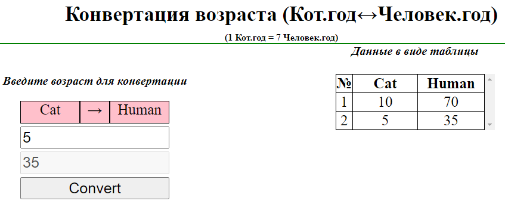
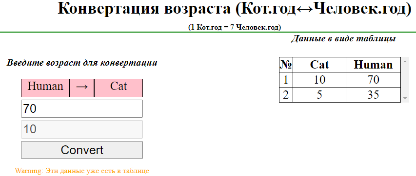

# Лабораторная работа № 3. JavaScript.

## Цель работы
Изучить основы программирования на JavaScript.

## Задание
Конвертер кошачьего возраста чел. год ↔ кош. год (сконвертированные значения должны добавляться в таблицу на странице после выполнения конвертации).

## Результат

### Начальный экран

### После конвертации в человечекий возраст

### После конвертации в кошачий возраст

### Предупреждение при добавлении дупликатов
