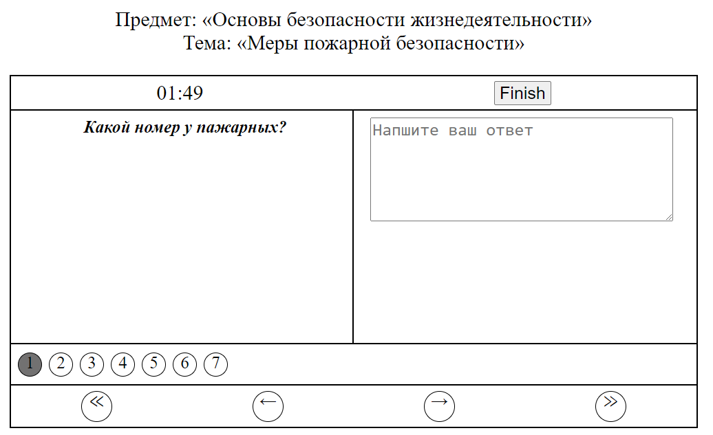
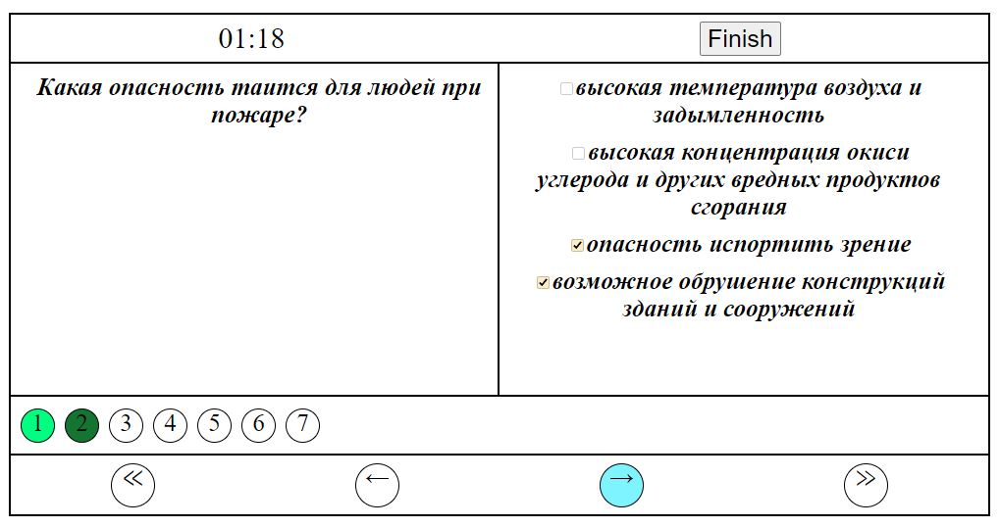

# Лабораторная работа № 4. JavaScript. Опросник

## Цель работы
Ознакомиться с основными возможностями JavaScript. Научиться применять его базовые структуры в html документах.

## Задание
Создать опросник по заданной предметной области. По клику на кнопке должна выполняться проверка вариантов ответов пользователя и выдаваться результат об успешном/не успешном завершении тестирования с подсветкой вопросов с правильными/неправильными ответами (выделение красным и зеленым). Анкета должна содержать не менее 10 вопросов. Каждый вопрос должен содержать не менее 4 вариантов ответов. Должен быть предусмотрен вопрос с множественным выбором вариантов (Check Box), вопрос открытого типа (Text Box), вопросы с выбором из выпадающего списка, вопросы с выбором одного варианта ответа (Radio Button). Станица должна быть оформлена с использованием CSS.  
**Предмет «Основы безопасности жизнедеятельности». Тестирование по теме «Меры пожарной безопасности»**.

## Результат

### Начальное окно (таймер)

### Окно с опросником

### 1

### 2

### Результаты теста
