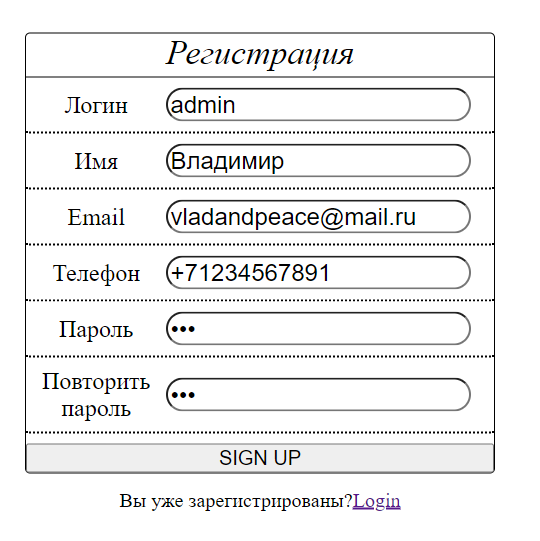
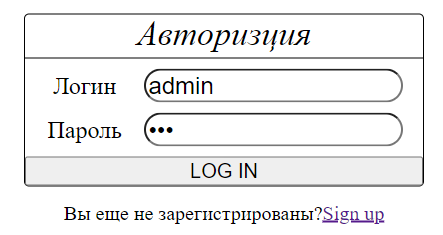
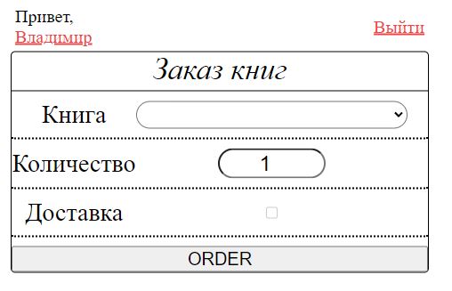
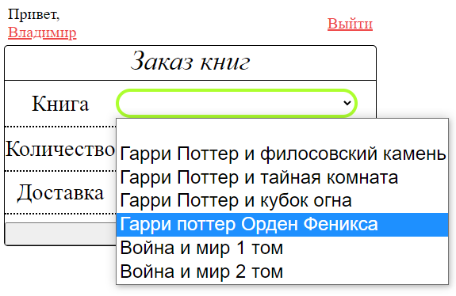
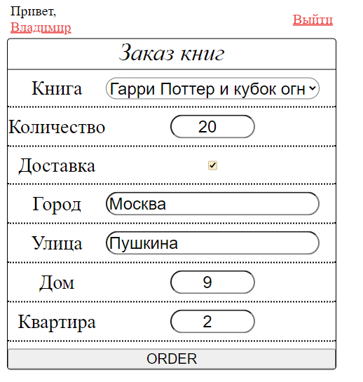
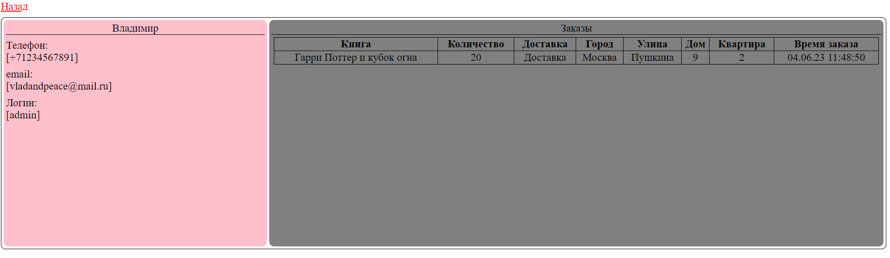

# Лабораторная работа № 6. Установка web-сервера

## Цель работы
Получить теоретические и практические навыки по работе с веб-сервером.

## Задание
Требования к выполнению индивидуального задания по лабораторной работе:
- минимум 5 полей формы;
- минимум 1 поле с выпадающим списком;
- минимум 2 поля для валидации;
- валидация должна проводиться на стороне сервера;
- результат валидации должен быть возвращен на форму JSON-строкой;
- при возникновении ошибки ввода данных необходимо сообщить
пользователю описание ошибки;
- все поля формы должны сохраняться в файл на сервере

**Форма заказа книги в онлайн магазине**

## Результат

### Форма регистрации

### Форма логина

### Экран после аутентификации

### Выбор книги

### Заполненная форма для заказа

### Профиль пользователя
