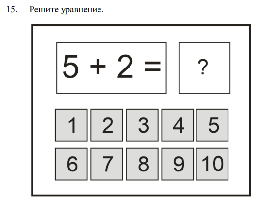
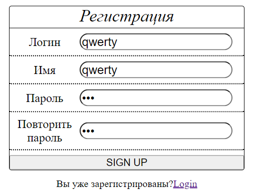
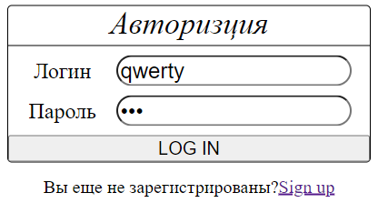
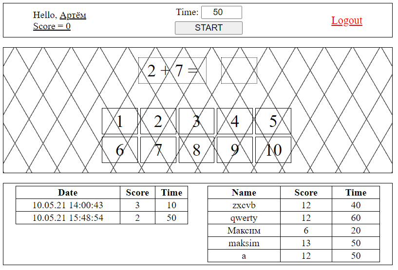
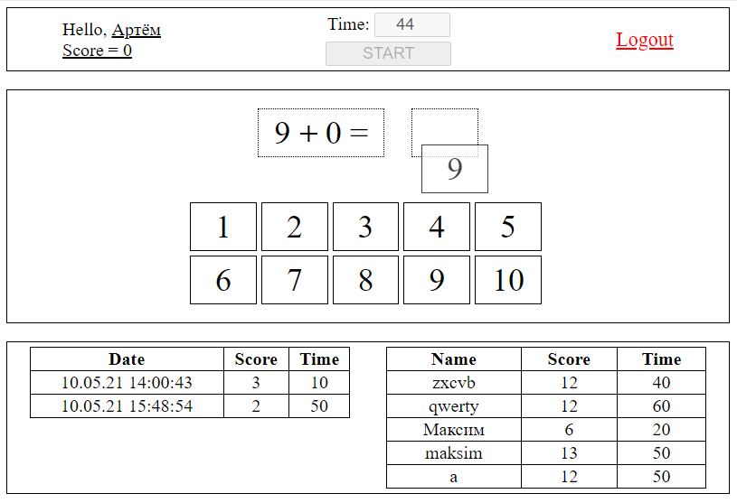

# Лабораторная работа № 7. Разработка клиент-серверного игрового приложения

## Цель работы
Ознакомиться с основными возможностями JavaScript, Framework jQuery, научиться применять его базовые структуры в html документах, получить практические навыки по работе с веб-сервером

## Задание
Требования к выполнению индивидуального задания по лабораторной
работе:
- реализовать авторизацию для запуска игры;
- генерировать каждое новое задание на стороне сервера;
- все вычисления игровых объектов должны проводиться на стороне
сервера;
- реализовать сбор статистики по игре и ее хранение на сервере;
- реализовать вывод статистики по игре для пользователя.

## Результат

### Форма регистрации

### Форма логина

### Вид экрана после аутентификации

#### Таблица слева - все результаты текущего игрока  
#### Таблица справа - лучшие результаты других игроков

### Drag and drop
